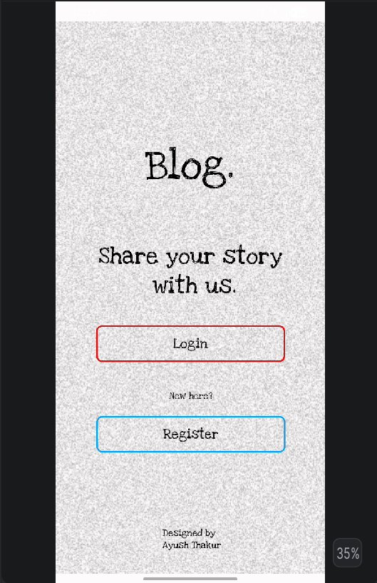
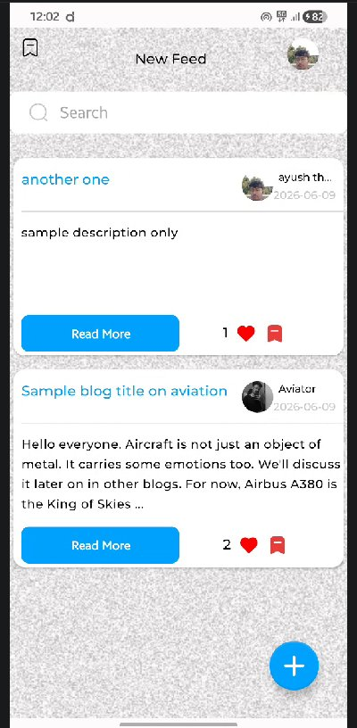
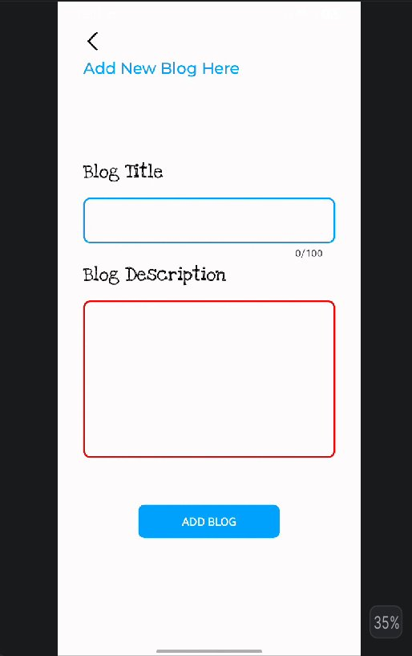
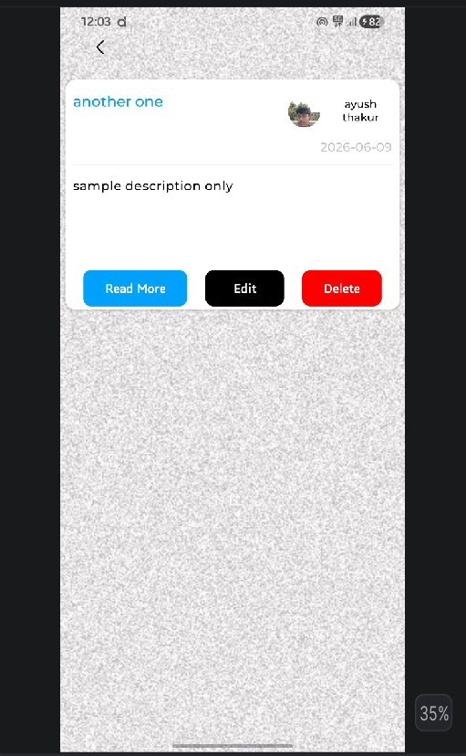
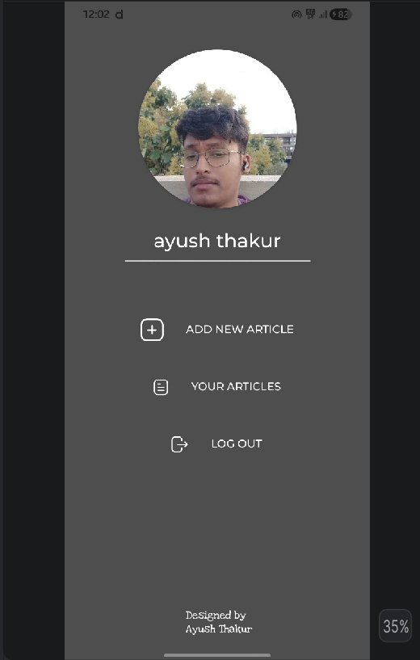

<h1 align="center">📝 The Blog App</h1>

<p align="center">
  A native Android blogging platform built with <strong>Kotlin</strong> and modern Jetpack libraries
</p>

<p align="center">
  
  
  
  
</p>

<p align="center">
  
  
  
</p>

---

## Overview

The Blog App is a native Android application that lets users **create, read, and manage blog posts** entirely from their device. It demonstrates clean Android architecture with local data persistence, lifecycle-aware components, and a fluid Material Design interface - written entirely in Kotlin.

---

## Screenshots

<p align="center">
  
  &nbsp;&nbsp;
  
  &nbsp;&nbsp;
  
  &nbsp;&nbsp;
  
  &nbsp;&nbsp;
  
</p>

<p align="center">
  <sub>Login &nbsp;|&nbsp; News Feed &nbsp;|&nbsp; Add Blog &nbsp;|&nbsp; Your Articles &nbsp;|&nbsp; Profile</sub>
</p>

---

## Features

- **🔐 Auth Flow** — Login & Register screens with form validation
- **📰 News Feed** — Scrollable feed of all published posts with search bar
- **❤️ Like & Bookmark** — React to posts directly from the feed
- **📝 Create & Publish** — Add a new blog with title and description
- **✏️ Edit & Delete** — Full CRUD on your own articles
- **👤 Profile Screen** — View your info and manage your content
- **💾 Offline-First** — All data persisted locally with Room Database

---

## Tech Stack

| Category | Technology |
|---|---|
| Language | Kotlin (100%) |
| Architecture | MVVM (Model-View-ViewModel) |
| UI | XML Layouts · Data Binding · Material Design 3 |
| Lifecycle | ViewModel · LiveData |
| Navigation | Jetpack Navigation Component |
| Local Storage | Room Database (SQLite) |
| Build | Gradle (Kotlin DSL) |

---

## Architecture

The app follows a clean MVVM layered architecture:

```
┌──────────────────────────────┐
│       Presentation Layer     │  Activities · Fragments · XML
├──────────────────────────────┤
│        ViewModel Layer       │  Business logic · UI State
├──────────────────────────────┤
│        Repository Layer      │  Single source of truth
├──────────────────────────────┤
│        Data Source Layer     │  Room Database
└──────────────────────────────┘
```

---

## Getting Started

### Prerequisites

- Android Studio Hedgehog (2023.1.1) or later
- JDK 11+
- Android SDK · API Level 21 (Android 5.0) minimum

### Setup

```bash
# Clone the repository
git clone https://github.com/thakur-027/The-Blog-App.git

# Open in Android Studio
# File → Open → Navigate to cloned folder → OK
# Wait for Gradle sync to complete
```

### Build & Run

```bash
# Debug APK (Unix/macOS)
./gradlew assembleDebug

# Debug APK (Windows)
gradlew.bat assembleDebug
```

Or press **Shift + F10** in Android Studio to run directly on your emulator or device.

> **Enable USB Debugging** on a physical device: Settings → About Phone → tap *Build Number* 7× → Developer Options → USB Debugging ✓

---

## Project Structure

```
The-Blog-App/
├── app/
│   └── src/main/
│       ├── java/         # Kotlin source — activities, fragments, VMs, repos
│       ├── res/          # Layouts, drawables, strings, themes
│       └── AndroidManifest.xml
├── contents/             # Screenshots and media assets
├── build.gradle.kts      # App-level build config
└── settings.gradle.kts   # Project settings
```

---

## Roadmap

- [ ] Firebase Authentication + cloud sync
- [ ] Image upload & media attachments
- [ ] Rich text editor (bold, italic, headings)
- [ ] Comment system
- [ ] Categories & tags
- [ ] Social sharing

---

## Author

**Ayush Thakur**  
Pre-final year ECE student @ SMVIT Bengaluru · Android Developer

[](https://github.com/thakur-027)

---

## License

This project is open source.
